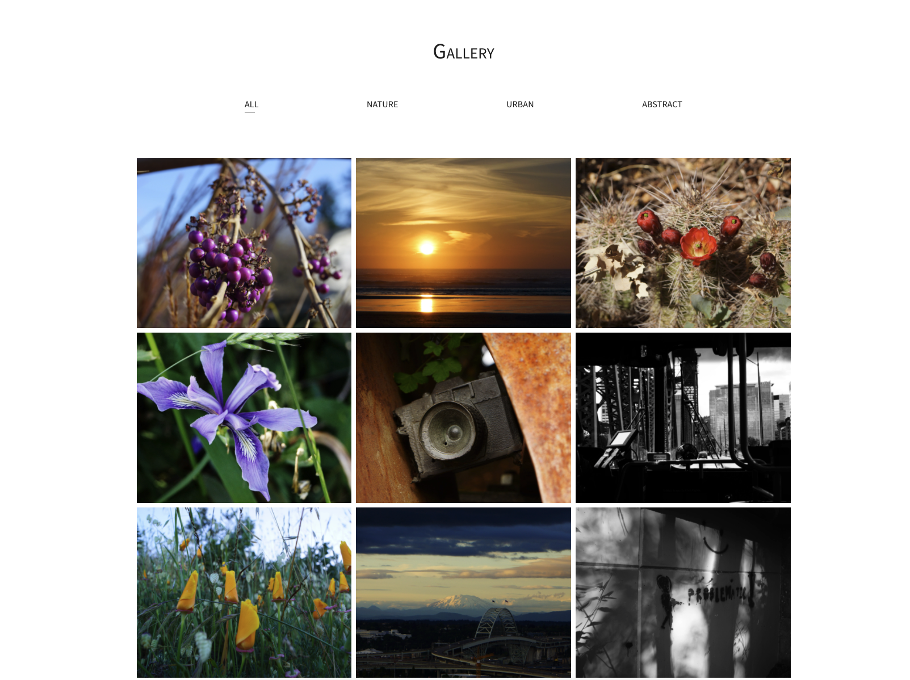
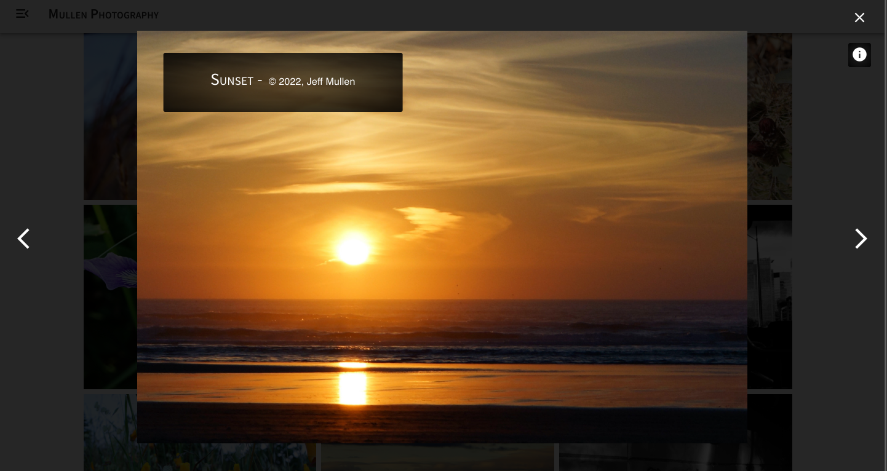
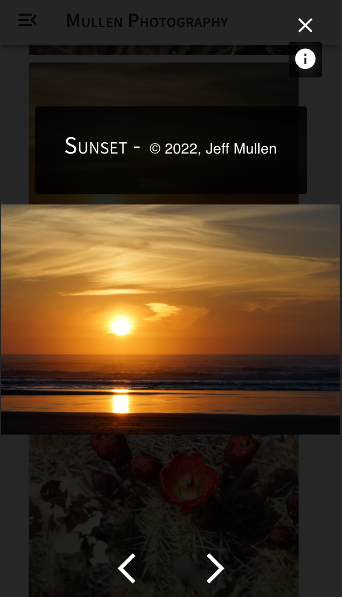

# Mullen Photography

## Table of Contents
  * [Description](#description)
  * [Technologies](#technologies)

## License 
  All media is covered by the Creative Commons License

## Technologies
* React
* MUI
* SASS(SCSS)
* JavaScript
* Redux Principles ( Actions, Reducers, Store Provider )

## Description
  This is a React frontend application showcasing my work, both photography and web development.  Both the design of the site and the photography itself show attention to detail and clean visual composition.

- The image modal was created using React and JavaScript

- Much of the other components are instances of MUI components at the base level.

    - Additional stylings added using the 'sx' prop that MUI uses for styling their components.

    - Elements created with traditional HTML are styled using SCSS modules.

- Typography and Palette adjustements made to the default theme of MUI

### Gallery Page

  
### Image Modal

### Mobile View

## Questions
  
  [github.com/jeffMullen](https://github.com/jeffMullen)

  If you have additional questions, feel free to reach me at jeffmullendev@gmail.com
